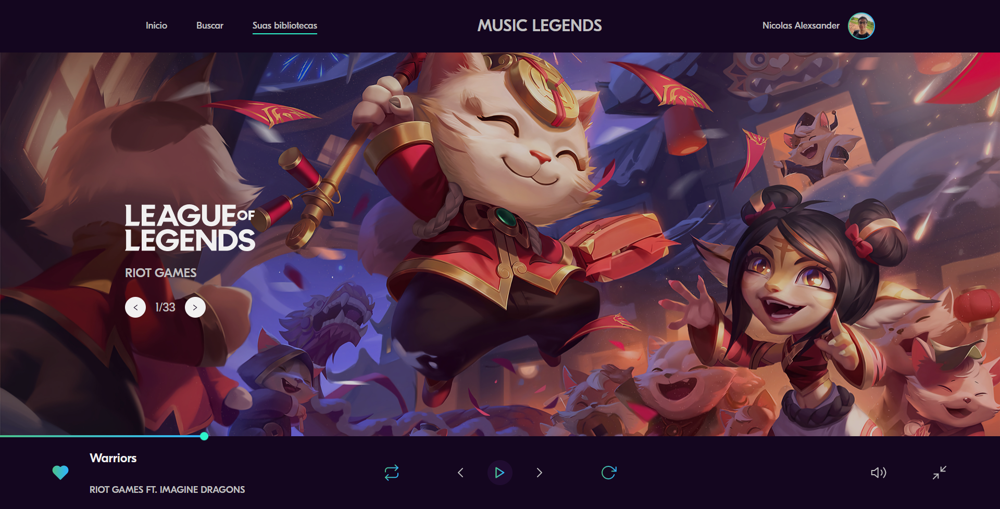

# Music Legends ReactJS 🎧



Um pequeno projeto de design de League of Legends, desenvolvido em
ReactJS utilizando Styled-Components.

Este projeto foi baseado no canal do Leo Vargas no Youtube

[Link do tutorial](https://www.youtube.com/watch?v=igI3jKsOyMA)

#

# Bibliotecas utilizadas

- [Styled-Components](https://styled-components.com/) (Estilizações)
- [React Icons](https://react-icons.github.io/react-icons/) (Pacote de ícones)

# Instalação

Para utilizar este projeto, abra seu terminal e digite

```bash
npm install
```

ou se preferir, utilize o

```bash
yarn install
```

Após instalar todas as dependências digite no seu terminal

```bash
npm start
```

ou

```bash
yarn start
```

E divirta-se 😄
